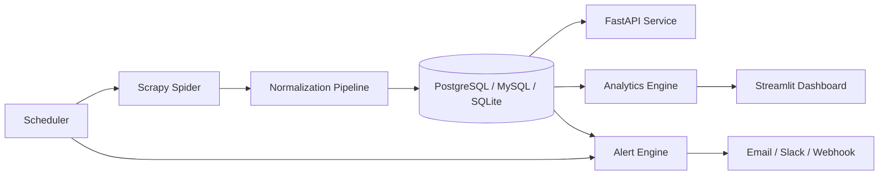

# Real-Time Price Monitoring System for Bearing Distributors

Production-oriented monitoring stack for Amazon India bearing listings, built with Scrapy, FastAPI, Streamlit, SQLAlchemy, and APScheduler.

## Architecture



## Features

- Query Amazon.in for SKF bearing searches.
- Track ASIN, title, seller, price, reviews, Buy Box seller, availability, and FBA.
- Simulate pincode-specific monitoring for `600001`, `560001`, and `110001`.
- Store normalized historical price, offers, and Buy Box events.
- Run analytics for trends, seller share, Buy Box win rate, and undercut detection.
- Expose a REST API and a Streamlit dashboard.
- Dispatch alerts by email, Slack, or generic webhook.
- Schedule recurring scrapes with an interval-based scheduler.

## Project Layout

```text
amazon_monitor/      Scrapy project, spider, middlewares, pipeline
analytics/           Price analysis service
api/                 FastAPI app
config/              Environment-driven settings
dashboard/           Streamlit dashboard
database/            SQLAlchemy models, repository, schema
monitoring/          Alert evaluation and dispatch
scheduler/           Automated scraping scheduler
```

## Quick Start

1. Create a virtual environment and install dependencies:

   ```powershell
   python -m venv .venv
   .\.venv\Scripts\Activate.ps1
   pip install -r requirements.txt
   playwright install chromium
   ```

2. Copy `.env.example` to `.env` and set `DATABASE_URL`.

3. Start the API:

   ```powershell
   uvicorn api.fastapi_app:app --reload
   ```

4. Start the dashboard:

   ```powershell
   streamlit run dashboard.py
   ```

5. Run a scrape manually:

   ```powershell
   scrapy crawl amazon_search
   ```

6. Start the scheduler:

   ```powershell
   python -m scheduler.scheduler --interval-minutes 30
   ```

## Database

- Production target: PostgreSQL or MySQL through `DATABASE_URL`.
- Local development fallback: SQLite via `sqlite:///amazon_monitor.db`.
- SQL schema: [database/schema.sql](/c:/JAVA_PROJECT_PRACTICE/amazon_price_monitor_project/database/schema.sql)

## Deployment

### Docker

```powershell
docker compose up --build
```

### Streamlit Cloud

- Deploy `dashboard.py`.
- Set `DATABASE_URL` and alert env vars in the app secrets.

### Railway / Supabase

- Provision PostgreSQL.
- Point `DATABASE_URL` to the managed instance.
- Deploy API and scheduler as separate services.

## Notes

- Amazon aggressively rate limits automated scraping. Proxy rotation, UA rotation, throttling, and optional Playwright fallback are included, but production operations still require careful tuning and compliance review.
- The repository seeds demo data automatically when the database is empty so the dashboard and API are usable immediately.
